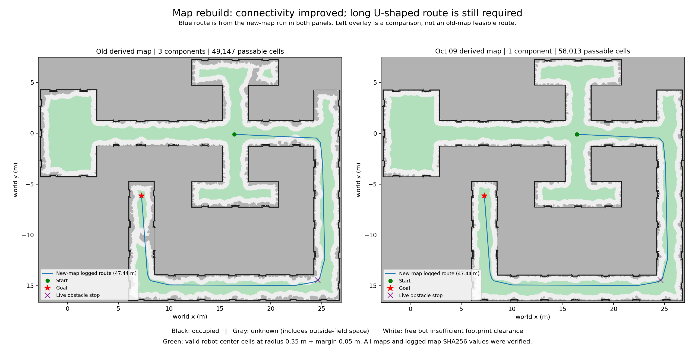

# 2026-10-09 目标 Ubuntu 迁回日志评估与修改建议

时间统一为北京时间。范围：`maps/` 中 10 月 9 日两轮采集、`navigation/run/` 中同日五轮导航，以及同批迁回的 `navigation/maps/field_a_20261009_170749/`。本轮为分析与建议，未修改官方代码、导航程序、运行配置或原始地图。

GitHub 副本保存本报告、结构化证据、对比图和正式地图产物。原始 bag 与运行日志按仓库规则在本地保留；下文指向 `raw_bag/`、`*.log`、`navigation/run/` 的链接用于本地追溯，在 GitHub 上不可直接打开。

**结论：重新建图有效，地图连通性和实际到达范围均改善。当前剩余问题是长绕行路线触发总时限，以及固定转角出现实时障碍停车。没有证据表明此前 SDK、连续恢复额度或规划阻塞问题复发。**

## 1. 建图评价：采集稳定，新图改善明确

正式建图轮次是 [run_20261009_162738_ri4mjc_v](maps/run_20261009_162738_ri4mjc_v/)。16:24 的短轮正常结束，但只有原始采集文件，没有最终地图，不应与正式地图混用。

| 指标 | 9 月 11 日基准 | 10 月 9 日正式轮 |
| --- | ---: | ---: |
| 雷达扫描帧 | 5,512 | 9,336 |
| 融合成功 / 拒绝帧 | 5,512 / 0 | 9,336 / 0 |
| 最终 PCD 点数 | 987,319 | 1,022,201 |
| 确认地面体素数 | 35,863 | 43,820 |
| 原始栅格自由格 | 30,986 | 37,767 |
| 派生图足迹可通行格 | 49,147 | 58,013 |
| 足迹可通行连通区域 | 3 | **1** |
| 最大连通区域的栅格面积 | 119.65 m² | **145.03 m²** |

相同足迹与派生参数下，可通行中心区域的面积增加 **18.0%**，最大连通面积增加 **21.2%**。这是栅格统计，不是对比赛场地面积的独立测量。

正式轮原始 bag 时长约 **15 分 33.6 秒**，有 459,101 条里程计消息。按各 topic 自身消息时间范围统计：雷达约 **10.0004 Hz**，最大相邻记录间隔 **112.8 ms**；里程计约 **491.77 Hz**，最大间隔 **15.28 ms**。SQLite 只读完整性检查通过，未见超过 250 ms 的中途记录间隔，支持本轮采集稳定。它仍不能证明传感器产生的每一帧都已送达记录器。

9,336 帧全部使用当前仿真支持的嵌入雷达位姿并融合成功；这一成功率不等于独立绝对精度验收，也不意味着每个地面区域都获得充分观测。基准与本轮建图算法哈希和主要参数一致，统计具有可比性；地图原点略有不同，不能直接逐像素相减。

其他观察：

- 16:24 短轮有 729 帧雷达，两个 topic 在采集结束前分别静默约 22.6 / 13.9 秒。可能是上游停止或仿真暂停，现有证据不能确定原因；其有效雷达区间仍约 9.986 Hz，不应算成持续降频。
- 正式轮 `finalize.log` 显示同一 bag 完整生成了两遍，输出点数一致。最终报告记录第二次：总耗时约 **471 秒**，其中融合约 **438 秒**。重复生成不会增加观测，应只在有明确参数修改时重做。
- 正式 bag 约 **4.66 GB**，比赛流程应预留录制空间和离线建图时间。
- 两轮原始 PGM 都仍较稀疏，按默认足迹直接膨胀后没有可通行格；应继续加载导航派生图。不能把原始矩形栅格约 84% 的未知区解释为“84% 比赛场地没采到”，矩形中还含场地外区域。

证据：[正式生成报告](maps/run_20261009_162738_ri4mjc_v/finalize_report.json)、[正式录制元数据](maps/run_20261009_162738_ri4mjc_v/raw_bag/metadata.yaml)、[生成日志](maps/run_20261009_162738_ri4mjc_v/finalize.log)、[新派生图报告](navigation/maps/field_a_20261009_170749/report.json)。

## 2. 地图是否正确切换

已核对迁回新图 YAML、PGM 的哈希与导航 `run.json` 一致；派生图报告所引用的原始 YAML、PGM、PCD 哈希也与迁回文件一致。

| 启动时间 | 模式 | 实际使用的地图 | 结果 |
| --- | --- | --- | --- |
| 17:15:52 | 预览 | 旧图 `task1_20260911` | 调整初始位姿，无目标 |
| 17:17:09 | 实际控制，0.40 m/s | 旧图 | 一个目标行进中程序关闭 |
| 17:23:48 | 预览 | 新图 `field_a_20261009_170749` | 约 7 秒退出，未初始定位 |
| 17:25:17 | 实际控制，0.40 m/s | 新图 | 2 次到达，1 次超时 |
| 17:37:05 | 实际控制，0.50 m/s | 新图 | 4 次到达，2 次实时障碍停车 |

因此前两轮仍是旧图，**17:23 后已成功切换新图**。五轮记录的 17 个导航源码文件 SHA256 均与当前代码一致；差异不是“Ubuntu 没更新代码”。

用同一规划器、相同目标和足迹重查：

- `(-0.025, -0.040) → (19.581, 6.110)`：旧图无路径，新图规划约 23.03 m，现场已到达。
- `(9.809, -14.868) → (7.234, -7.212)`：旧图无路径，新图约 9.11 m，现场已到达。
- `(23.199, -15.332) → (7.699, -10.579)`：旧图目标余量不足，新图约 19.07 m，现场已到达。

这比仅看 PCD 点数增加更能说明重建有效。全图只有一个足迹连通区域，仍不表示所有白色像素、宝箱接触点或任意点击点都可导航。



图中浅绿为足迹可通行中心区域；蓝线是新图日志中的约 47.44 m 规划路线，左图仅叠加作位置对照，不表示旧图能规划此路线。紫叉为最新轮两次实时障碍停车附近。灰色既包含未观测区，也包含场地之外，不能全部当作应涂白的空地。

## 3. 导航评价：到达有效，三次保护停车原因不同

新图两轮实际控制共 **9 个目标：6 次到达、1 次总时限停止、2 次实时障碍停止**。另有旧图一轮 1 个目标被程序关闭中断，不计为自主导航失败，也不能计为到达。

下面耗时从 `clicked_goal` 到结果事件，路线长为首次 `planned_path` 折线长度：

| 轮次 / 目标 | 目标 XY，m | 初始路径 | 耗时 | 结果 |
| --- | --- | ---: | ---: | --- |
| 17:17 / 1 | (16.522, 5.914) | 20.79 m | 56.17 s | 程序关闭中断 |
| 17:25 / 1 | (19.581, 6.110) | 23.03 m | 89.51 s | ARRIVED |
| 17:25 / 2 | (7.269, -6.745) | 53.29 m | 180.02 s | 总时限停止 |
| 17:25 / 3 | (7.234, -7.212) | 9.11 m | 35.63 s | ARRIVED |
| 17:37 / 1 | (4.769, 0.189) | 4.79 m | 13.83 s | ARRIVED |
| 17:37 / 2 | (16.479, -0.104) | 11.80 m | 27.54 s | ARRIVED |
| 17:37 / 3 | (7.282, -6.117) | 47.44 m | 78.78 s | 实时障碍停止 |
| 17:37 / 4 | (7.842, -14.444) | 17.03 m | 5.93 s | 实时障碍停止 |
| 17:37 / 5 | (22.980, -15.298) | 2.18 m | 14.43 s | ARRIVED |
| 17:37 / 6 | (7.699, -10.579) | 19.07 m | 65.82 s | ARRIVED |

三轮实际控制均连接 SDK 并进入 `TASK2_READY`；没有 SDK 失败、传感器拒收或跟踪偏移重规划记录。五轮节点和 RViz 退出码均为 0。

六次到达的估计终点误差约 **8.6～9.3 cm**，到达事件中的测量速度也满足停稳阈值。不过这是人工初始对齐后、基于里程计的地图坐标误差，没有独立真值，不能直接宣布真实场地绝对定位精度为 9 cm。

### 3.1 这一次确实发生了 180 秒超时

17:25 第 2 个目标的停止原因明确为：

```text
Goal time limit exceeded
```

证据：[node.log](navigation/run/run_20261009_172517_kklh34zv/node.log) 第 60 行；[events.jsonl](navigation/run/run_20261009_172517_kklh34zv/events.jsonl) 第 283 行点击、第 290 行规划、第 648 行超时。

此目标规划 **53.29 m、20 个路点**，没有重规划，停止前最后一个轨迹快照仍剩 **9.68 m**。依据停止位置和原路径估算还剩约 9.58 m。本次与 10 月 2 日的“累计恢复额度耗尽”是不同问题。

53 m 以 0.40 m/s 匀速也需要约 133 秒；加上 18 个中间路点的减速、转向和停稳，180 秒并不充裕。新图实际走廊呈较大的绕行结构；另一条直线距离约 10.93 m 的目标需要 47.44 m 路径，不能按直线距离估时。

只读对照中，移除额外余量的软代价、使用普通网格最短路，仍需约 48 m 绕行。网格折线与平滑路径长度不能当作完全相同的最优值比较，但支持“主要绕行来自地图通道结构”，而非单纯规划器过度偏好余量。是否存在地图未记录的真实捷径，仍需现场确认。

超时触发时线速度记录为 0.304 m/s；约 0.50 秒后的首个轨迹样本降至 0.00347 m/s、角速度 0.00978 rad/s，位置再变化约 3.52 cm。停车请求有效；采样间隔约 0.5 秒，不能由此得出更精确的制动时间。`STOPPED` 表示已取消目标、发出零指令，不是物理速度瞬间归零。

### 3.2 两次实时障碍停车集中在同一转角

17:37 两次停止位置约：

- `(24.610, -14.441)`；
- `(24.429, -14.549)`。

证据：[node.log](navigation/run/run_20261009_173705_dhnzktx1/node.log) 第 35、43 行；[events.jsonl](navigation/run/run_20261009_173705_dhnzktx1/events.jsonl) 第 312、452 行。

原因均为 `Live obstacle: stopped; inspect and choose another goal`。两次都在转弯完成、准备再前进时触发，线速度分别仅 **0.0078、0.0054 m/s**；不能描述成“0.50 m/s 高速撞上障碍”。

静态派生图上的对应位置仍可通行，余量约 0.50 / 0.56 m，高于 0.40 m 硬要求。在本轮采集 PCD 的 0.15～1.20 m 高度点中，两个位置附近的最近障碍投影距离约 0.61 / 0.63 m；这只是旧扫描与当前估计坐标的比对，并非停车当时的真实雷达证据。

当前保护逻辑只要有一个有效障碍点进入预测足迹覆盖区就停车。导航日志没有保存当时原始点云、命中点、最近距离或对齐残差，因此仍需区分：

1. 地图未包含的实际物体，或场景变化；
2. 人工初始定位/朝向与静态地图不一致；
3. 雷达外参、地面高度判断或仿真点云噪点；
4. 转角局部路径与预测运动之间的差异。

这些是待验证原因，不是已确定根因。仅反复点击新目标、降低足迹或关闭实时避障不能完成排查。

### 3.3 人工初始定位应固定成可重复操作

17:37 一轮共有 **15 次初始位姿设置**：出发前 2 次、两次障碍停车后 8 次、短目标到达后又 5 次。全部 `accepted` 只表示输入满足程序条件，不表示与场景准确对齐。

例如第 527 条事件把显示位置调整了约 0.82 m、朝向调整约 12.4°；另一次朝向调整约 17.8°。这些是人工改动幅度，不能写成机器人里程计漂移。

`2D Pose Estimate` 只修改地图与里程计之间的变换，不移动机器狗，也不是自动地图匹配。重定位后目标成功不能证明此前障碍一定是误报。建议以可辨认的墙角和两条不平行墙面对齐，同时核对近处与远处雷达叠加，再固定该定位完成一组测试。

## 4. 建议按这个顺序修改和复测

### 优先级 1：先解决明确的长路线预算

立即可采用中间点分段导航；若需要一次完成同类 50 m 长绕行，在**该场地配置**中做受控复测：

```yaml
max_speed: 0.40
max_yaw_rate: 0.60
goal_timeout: 300.0
progress_timeout: 15.0
```

这只是建议测试配置，本轮没有替你修改。延长 `goal_timeout` 有本次明确超时证据支撑；保留无进展、传感器过期、独立 SDK 看门狗与实时障碍停车。不要全局放宽所有超时。

后续程序建议：规划完成后显示路径长度、转弯数量和保守预计耗时；按这些指标生成有上限的目标时间预算，或提前提示本轮 180 秒可能不足。重规划不应无限刷新总预算。

### 优先级 2：给实时障碍停车增加足够诊断

在自有 `navigation/` 扩展内记录停车前的拟发速度、实际速度、预测距离、命中点的机器人相对坐标、障碍点数量/高度、当前对齐变换和完整路径。`fail()` 清空目标前先保存这些上下文。

在 `(24.6, -14.5)` 附近受控复测，同时录制当时雷达与里程计，以及初始位姿、目标和导航状态。现有建图 bag 是更早时段的数据，不能替代停车当时的点云。

有了证据再决定是否补扫真实物体、修定位/外参，或对孤立噪点增加空间/时间一致性校验。若增加滤波，须保留细小真实障碍的检测验证，不建议仅删除“单个点触发停车”的逻辑。

### 优先级 3：固定速度与定位，完成相同路线对照

先用 `0.40 / 0.60` 固定基线复测长路线和该转角，再对同一路线试 `0.50 / 0.60`。今天两轮起点、目标和人工定位不同，不能把结果直接当成速度 A/B 实验。

0.50 m/s 已是当前程序允许的前进上限，暂不继续提高。满速时默认模型的停止预测距离约从 0.70 m 增到 0.97 m，但本轮两次障碍停止发生在起步阶段，尚不能证明是该变化引起。

继续保留 `robot_radius=0.35`、`safety_margin=0.05`、`max-edge=0.30`、导航派生 `band=0.06`。新图已经连通，不需要为这次停车继续扩大地面补全或缩小机器狗尺寸。

### 优先级 4：补地图版本提示与建图质量摘要

启动时显著显示场地名、地图绝对路径和地图哈希；新建图成功后给出该场地配置的明确启动命令，避免前两轮仍跑旧图的情况。

采集收尾显示每个 topic 的有效时长、记录率和尾部静默；finalize 已成功时提醒重复执行不会增加覆盖。保留原始 bag，让参数对比生成新版本，不覆盖已验收结果。

### 优先级 5：核对 RViz 地图显示

五轮 `rviz.log` 均有 `indexed_8bit_image` GLSL 链接报错：

```text
active samplers with a different type refer to the same texture image unit
```

这是渲染异常线索，没有证据说明它直接导致路径或停车错误。需要确认地图、足迹图和雷达叠加是否实际可见、可读；若图层缺失或失真，应先解决显示问题再人工定位。普通 `Stereo is NOT SUPPORTED` 提示与此错误分开看。退出码为 0 也不保证每个图层绘制正确。

## 5. 下一轮验收建议

保留当前新图，固定出生点与初始对齐；先在 0.40 m/s、300 秒单目标总限下复测 53 m 路线，再单独往返测试右下转角。每轮保存实际配置、完整导航日志和停车附近原始传感器记录。

判断依据应是：同一路线可以重复到达、停稳后不再恢复旧目标；超时不再无故中断仍在有效前进的路线；实时障碍停车能指出具体障碍证据。未完成这些复测前，可评价为“地图重建成功，点选导航已可用，长路线与局部避障仍需完善”，不宜直接写成比赛全场验收完成。

结构化证据与图示见 [diagnostics/log_review_20261009](diagnostics/log_review_20261009/)。
